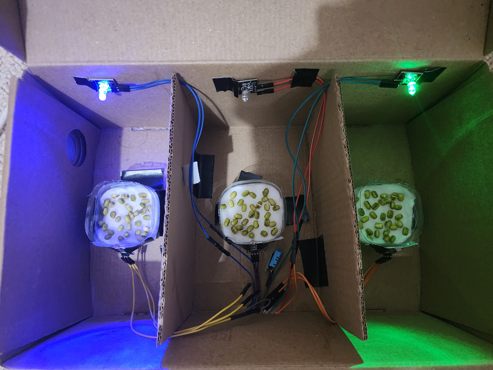
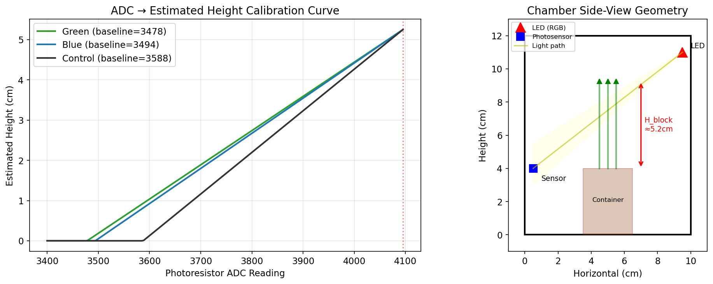
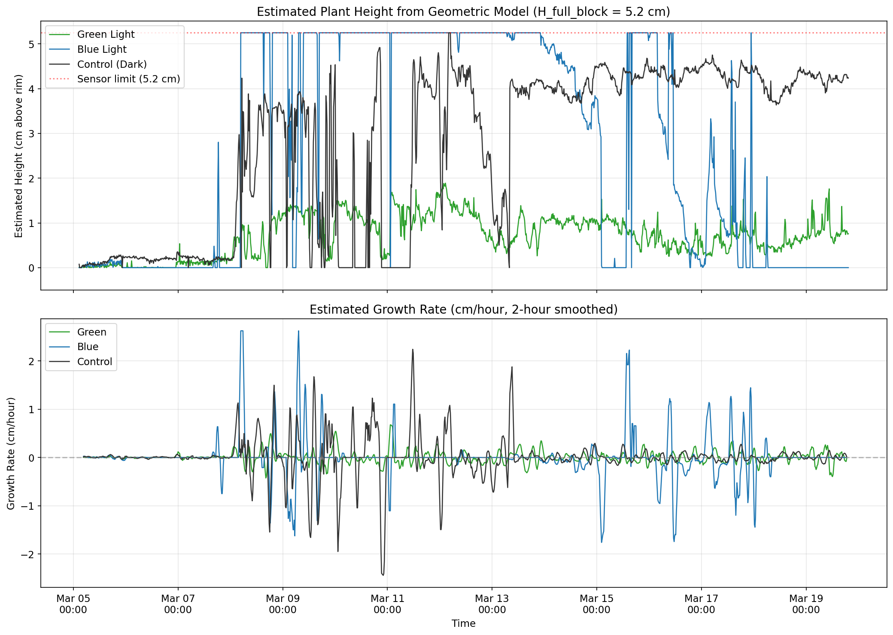

# The Effect of Colored Light on Bean Sprout Growth

**CID: 06043088** | ELEC70126 — Internet of Things and Applications

---

## Part 1: Sensing (50%)

### 1. Introduction and Objectives

Mung bean sprouts (*Vigna radiata*) are a widely cultivated crop known for their rapid germination and vigorous growth in dark conditions. This experiment investigates how exposure to different wavelengths of visible light — specifically blue (~450 nm) and green (~520 nm) — affects the rate of sprout growth compared to a dark control group.

**Objectives:**

- Quantify the growth deceleration (or acceleration) of mung bean sprouts under blue and green light relative to a dark control.
- Design and deploy an end-to-end IoT sensing system using ESP32, photoresistors, and environmental sensors.
- Collect continuous time-series data over a week-long experiment with automated cloud-based storage.
- Identify any unexpected plant behaviors (e.g., phototropic movement) observable through the sensor data.

**Hypothesis:** Blue light, known to stimulate phototropin receptors and influence photomorphogenesis, is expected to induce a stronger growth response than green light, while the dark control should exhibit uninhibited etiolated growth.

### 2. Data Sources and Sensing Set-Up

#### 2.1 Physical Setup

The experiment uses a divided cardboard enclosure (a repurposed shoebox) partitioned into three isolated chambers:

| Chamber | Condition | Light Source |
|---------|-----------|-------------|
| Left | Blue light (continuous) | Blue LED (GPIO 47, PWM brightness 255) |
| Centre | Control/Dark | No light (1-second red pulse every 15 min for measurement only) |
| Right | Green light (continuous) | Green LED (GPIO 48, PWM brightness 50) |

Each chamber contains a small plastic container with mung beans placed on wet cotton wool as the growth medium. Cardboard dividers prevent light contamination between chambers.


*Figure 1: Experiment setup on Day 1 showing the three chambers with mung beans on cotton wool.*

#### 2.2 Sensor Configuration

The system employs **two types of time-series data sources** of different nature:

**1. Photoresistors (Light-Dependent Resistors — LDRs)** — 3 units
- Connected to ESP32 ADC pins (GPIO 1, 2, 4) for green, blue, and control chambers respectively.
- Each LDR is paired with a red measurement LED. As bean sprouts grow and obstruct the optical path between the LED and the sensor, the ADC reading increases (less light reaches the sensor = higher resistance = higher ADC value).
- The red measurement LED is only activated for a brief 5-second pulse every 15 minutes to avoid influencing growth, and the ADC is sampled 2 seconds into this pulse for stable readings.
- ADC resolution: 12-bit (0–4095).

**2. DHT11 Temperature and Humidity Sensor** — 1 unit
- Connected to GPIO 5, embedded in the cotton growth medium of the control chamber.
- Provides ambient temperature (°C) and relative humidity (%) readings at each 15-minute interval.
- Serves a dual purpose: monitoring environmental consistency and enabling future hydration-based actuation.

#### 2.3 Microcontroller and Wiring

The ESP32 microcontroller manages all sensor readings and LED control. Key components:

- **ESP32 DevKit V1**: Dual-core processor with integrated Wi-Fi, running at 240 MHz.
- **RTC DS1307**: External real-time clock (I2C on GPIO 6/7) for accurate timestamping independent of Wi-Fi connectivity.
- **Breadboard and jumper wires**: For prototyping connections.

#### 2.4 Design Choices

| Design Decision | Choice | Justification |
|----------------|--------|---------------|
| Measurement interval | 15 minutes | Balances temporal resolution (96 samples/day) with minimal light exposure to control group |
| Red measurement LED | 5-second pulse | Red wavelength (~620 nm) has minimal effect on plant growth hormones; short pulse limits total photon exposure |
| ADC read timing | 2 seconds into pulse | Allows photoresistor to stabilise after LED activation |
| Sensor type (LDR) | Analogue photoresistor | Direct, low-cost growth proxy; monotonic relationship between obstruction and ADC reading |
| Environmental sensor | DHT11 | Adequate resolution for ambient monitoring (±2°C, ±5% RH); low cost |

### 3. Data Collection and Storage/Communications Process

#### 3.1 Data Pipeline Architecture

```
ESP32 Sensors → Wi-Fi (HTTP GET) → Google Apps Script → Google Sheets → CSV Export
```

1. **Acquisition**: Every 15 minutes, the ESP32 activates the red measurement LED, waits 2 seconds, reads all 3 photoresistors and the DHT11, then turns off the red LED.

2. **Transmission**: Sensor data is encoded as URL parameters in an HTTP GET request and sent to a Google Apps Script web endpoint. The URL format:
   ```
   https://script.google.com/.../exec?timestamp=...&green=...&blue=...&control=...&temperature=...&humidity=...
   ```

3. **Storage**: The Google Apps Script appends each data point as a new row in a Google Sheet. This provides:
   - Cloud-based persistent storage with automatic backup
   - Real-time accessibility from any device
   - Easy export to CSV for analysis

4. **Resilience**: If Wi-Fi disconnects, the ESP32 automatically attempts reconnection. Data points during outages are lost (a trade-off for simplicity — see Section 4).

#### 3.2 Data Characteristics

| Parameter | Value |
|-----------|-------|
| Sampling interval | 15 minutes |
| Total data points | 558 |
| Duration | 5 days 20 hours (5 Mar – 10 Mar 2026) |
| Channels | 5 (Green ADC, Blue ADC, Control ADC, Temperature, Humidity) |
| Data format | CSV (timestamp + 5 numeric columns) |
| Total data size | ~30 KB |

#### 3.3 Data Cleaning

Two types of anomalies were identified and addressed:

**Type 1: Physical disturbance artefacts** — Sudden simultaneous drops in all three photoresistor channels (e.g., Green=2196, Blue=2432, Control=2281 at 08/03/2026 14:13). These occurred when the enclosure was opened for watering, causing the sensor or breadboard to shift momentarily. Detection criterion: |Δ| > 200 in *all three channels simultaneously*. Affected rows were replaced via linear interpolation.

**Type 2: Sensor saturation** — The blue channel reached the ADC maximum (4095) approximately 3 days into the experiment, after which it could no longer resolve growth differences. This is a known limitation of the 12-bit ADC range and is discussed in the analysis.

### 4. Basic Characteristics of the End-to-End Data Acquisition Setup

#### 4.1 System Performance

| Metric | Value |
|--------|-------|
| Sampling rate | 1 sample / 15 min (96 samples/day) |
| Data throughput | ~50 bytes/sample × 96 samples/day ≈ 4.8 KB/day |
| Latency (sensor → cloud) | ~2–5 seconds (Wi-Fi HTTP round trip) |
| Power consumption | ~150 mA continuous (ESP32 + LEDs), USB-powered |
| Uptime | >99% (one brief outage during experiment) |
| ADC resolution | 12-bit (0–4095), ~0.8 mV per step |

#### 4.2 Trade-Off Analysis

| Trade-Off | Decision | Rationale |
|-----------|----------|-----------|
| **Local vs Cloud processing** | Cloud (Google Sheets) | Simplifies firmware; enables real-time remote monitoring; no local storage needed for ~5 KB/day |
| **Sampling rate vs Light exposure** | 15-min interval | Higher rates would increase red LED exposure to the control group; 15 min is sufficient for growth dynamics (plants grow on hour-scale) |
| **Accuracy vs Cost** | DHT11 (±2°C) over BME280 (±0.5°C) | Environmental monitoring requires trend detection, not precision; DHT11 costs ~£1 vs ~£8 for BME280 |
| **Generic vs Bespoke hardware** | Generic ESP32 + breadboard | Rapid prototyping; widely available; sufficient GPIO and ADC channels; trade-off is less robust physical connections |
| **Reliability vs Simplicity** | No local buffering | If Wi-Fi drops, data is lost; acceptable for a week-long experiment in a stable Wi-Fi environment |
| **Price vs Functionality** | Total BOM ~£15 | ESP32 (£5) + 3×LDR (£1) + DHT11 (£1) + LEDs/resistors (£2) + breadboard (£3) + RTC (£3). Sufficient for proof-of-concept |
| **Throughput vs Power** | USB-powered (no battery) | Eliminates power budgeting; acceptable for stationary indoor experiment |

#### 4.3 Limitations

1. **Sensor saturation**: The blue channel hit 4095 ADC, beyond which growth cannot be differentiated. A higher-range sensor or a more attenuated LED could resolve this.
2. **Ambient light interference in the green chamber**: The continuously-on green LED illuminates the entire chamber, meaning green photons can reach the photoresistor even when the red measurement LED path is partially obstructed by sprouts. This causes the green group's ADC readings to underrepresent actual growth. A narrow-band optical filter on the photoresistor (passing only red wavelengths) would isolate the measurement signal from ambient light.
3. **Phototropic bending confounds control readings**: The control group's sensor measures a combination of growth and lateral movement. The sprouts grow but also bend toward light leaks, moving out of the sensor path. Multiple sensors at different angles per chamber would decouple growth from movement.
4. **Single environmental sensor**: Only one DHT11 in the control chamber; temperature/humidity may vary slightly between chambers.
5. **No local data buffering**: Wi-Fi dropouts cause data loss. An SD card module would provide resilience for ~£2 additional cost.
6. **Mechanical fragility**: Breadboard connections and taped sensors are prone to disturbance during watering, causing the anomalies observed.

---

## Part 2: Internet of Things (50%)

### 1. Data Interaction/Visualisation/Actuation Platform

#### 1.1 Interactive Dashboard (Streamlit Web App)

An interactive web application was built using **Streamlit** (Python) with **Plotly** for visualisation. The app provides five view modes:

1. **Dashboard**: Overview of all growth curves with raw/cleaned data toggle, sensor saturation markers, and baseline-normalised growth.
2. **Growth Explorer**: Configurable growth rate computation with adjustable window size and smoothing, plus daily growth bar charts.
3. **Movement Analysis**: Detrending tool to isolate plant oscillation patterns, with FFT frequency spectrum analysis to identify periodic movement.
4. **Environmental**: Temperature and humidity time series with scatter plots showing correlation between environmental conditions and growth rate.
5. **Compare & Stats**: Welch's t-test results, box plots of growth rate distributions, and cross-correlation heatmaps.

**Key interactive features:**
- Time range slider to zoom into specific periods
- Adjustable smoothing window
- Channel selection for movement analysis
- Raw vs cleaned data toggle
- Embedded raw data table viewer

**To run the app:**
```bash
streamlit run app/bean_sprout_dashboard.py
```

#### 1.2 Data Flow (End-to-End)

```
ESP32 → Wi-Fi → Google Sheets (live) → CSV export → Pandas → Streamlit Dashboard
                                                    ↓
                                              Jupyter Notebook (analysis)
```

The Google Sheet also served as a real-time monitoring interface during the experiment, allowing remote checking of sensor health without opening the enclosure.

### 2. Data Analytics, Inferences and Insights

#### 2.1 Growth Comparison

Analysis of the cleaned dataset reveals clear differences between the three treatment groups:

| Group | Baseline (ADC) | Final (ADC) | Total Change | Notes |
|-------|----------------|-------------|-------------|-------|
| Green | 3479 | ~3528 | +49 | Moderate growth, but underrepresented by sensor (see below) |
| Blue | 3491 | 4095 | +604* | *Saturated — true growth exceeds this |
| Control | 3595 | ~3045 | -550 | Growing normally, but phototropic bending moves sprouts away from sensor path |

**Key findings:**

1. **Blue light dramatically accelerated growth**: The blue-light group saturated the 12-bit ADC sensor (~3 days in, at ~72 hours). This is consistent with blue light activating phototropin and cryptochrome receptors that promote cell elongation in plants. Manual observation confirmed the blue group produced the tallest sprouts with visibly green, chlorophyll-rich leaves.

2. **Green light produced decent but sensor-underrepresented growth**: The green-light group showed only ~49 ADC units of change over 5+ days. However, this likely underrepresents actual growth: because the chamber is continuously illuminated with green light, the ambient green photons can partially reach the photoresistor even when sprouts obstruct the red measurement LED path — effectively "leaking" through the foliage and keeping readings lower than expected. Visual observation confirmed the green group had reasonable growth with leaves showing a slight hint of green coloration.

3. **Control group grew normally but revealed plant movement**: The control group's net negative ADC change (-550) does *not* indicate less growth. Rather, the sprouts grew vigorously in the dark (etiolated growth) but bent sideways due to phototropism — likely toward faint blue light leaking from the adjacent chamber. This bending moved the sprouts *out of* the sensor's optical path, causing the photoresistor reading to *decrease* (more light reaching the sensor). The oscillations of up to ±500 ADC units reflect the sprouts swaying back and forth as they search for light. This is the most unexpected and scientifically interesting finding.

#### 2.2 Leaf Coloration Observations (Manual/Camera)

Beyond the sensor data, manual visual inspection revealed a striking difference in leaf development across groups:

| Group | Leaf Appearance | Interpretation |
|-------|----------------|----------------|
| Blue light | Green, healthy-looking leaves | Blue light activates chlorophyll biosynthesis pathways; promotes photomorphogenesis |
| Green light | Slight hint of green on leaves | Partial photomorphogenic response; green light has limited but non-zero effect on chloroplast development |
| Control (dark) | Yellowish, etiolated leaves | No light stimulus for chlorophyll production; classic etiolation response |

This observation, while outside the scope of the automated sensor system, provides a valuable qualitative complement to the quantitative photoresistor data. It suggests that a future iteration could incorporate a **colour sensor (e.g., TCS34725)** to quantify leaf chlorophyll content as an additional growth metric — linking light wavelength not just to stem elongation but also to photosynthetic development.

#### 2.3 Geometric Height Estimation Model

Since no direct height measurement sensor was available, we developed a **geometric model** to estimate plant height from ADC readings using the physical setup dimensions.

**Model**: The LED is mounted at the top corner of each chamber (~11 cm above the box floor), and the photosensor sits at the container rim (~4 cm). The light path travels diagonally from LED to sensor. As the plant grows vertically from the container rim, it progressively blocks this light cone. Using trigonometry:

1. Calculate the line-of-sight height at the plant's horizontal position: `h = H_sensor + (H_led - H_sensor) × (X_plant / D_horizontal) = 7.5 cm`
2. The direct block height above the container rim: `7.5 - 4.0 = 3.5 cm`
3. Accounting for LED cone spread (factor 1.5×): **H_full_block ≈ 5.2 cm**
4. `obstruction_ratio = (ADC - baseline) / (4095 - baseline)` → range [0, 1]
5. `estimated_height = obstruction_ratio × 5.2 cm`

| Group | Estimated Final Height | Peak Height | Avg Growth Rate |
|-------|----------------------|-------------|-----------------|
| Blue | 5.2 cm (saturated) | ≥5.2 cm | Fastest — reached sensor limit in ~3 days |
| Green | ~0.4 cm | ~0.6 cm | Slow — but underestimated due to green light leak |
| Control | ~0 cm (oscillating) | ~2.5 cm | Movement dominates — not a valid height reading |

**Limitations**: The linear obstruction assumption is a first-order approximation. Plant density, leaf spread, and lateral bending all affect the actual ADC-to-height relationship. The model is most accurate for the blue group (predominately vertical growth) and least reliable for the control group (dominated by lateral movement). The geometry parameters (LED height, distances) are estimated from photographs and can be refined with direct measurement.


*Figure: Left — ADC to estimated height calibration curve for each channel. Right — Side-view chamber geometry showing LED, sensor, and plant positions.*


*Figure: Estimated plant height over time (top) and growth rate in cm/hour (bottom), derived from the geometric model.*

#### 2.4 Plant Movement and ADC Drop Events

All three groups exhibit periodic drops in ADC readings. Crucially, **none of these drops indicate the plant shrinking** — they are all caused by different forms of plant movement:

**Control group (dark)**: The sprouts grow in the dark but exhibit **phototropism toward blue light leaking** from the adjacent chamber. This bending moves the sprouts out of the sensor's optical path (reading drops). New growth reaches back into the path (reading rises), creating the oscillatory pattern. This is classical circumnutation amplified by directional light cues.

**Blue and Green groups (illuminated)**: The sprouts grow *toward* the light source (the LED, which is also the treatment light). Initially, upward growth blocks more of the sensor path (ADC rises). However, once the stems **outgrow the chamber space**, they become top-heavy and disarray — flopping over, tangling with neighbours, or bending against the chamber walls. When this happens, leaves and stems that were previously blocking the sensor path shift aside, causing sudden ADC drops. New growth then fills the gaps, and the reading recovers. This explains the intermittent spikes and drops seen particularly in the blue channel after it first saturated — the plant kept growing but periodically rearranging itself within the confined space.

Detrending and FFT analysis of the control signal shows spectral energy concentrated near a **~12-hour period**, suggesting the sprouts have a semi-diurnal movement cycle. This could relate to internal circadian rhythms or the periodicity of watering events.

This finding transforms the experiment from a simple growth rate study into a dual investigation of both **growth kinetics** and **plant movement dynamics** — a richer dataset than originally planned.

#### 2.4 A Note on Cross-Correlation Between Chambers

The cross-correlation matrix between Green, Blue, and Control ADC channels is presented in the analysis notebook. However, it is important to note that **direct correlation between chambers has limited causal meaning** — the three groups are in physically isolated chambers and are not expected to influence each other. Any observed correlation between channels is more likely driven by shared environmental factors (temperature, humidity, time of day) affecting all three groups simultaneously, rather than a direct relationship between them.

The more meaningful correlations are:
- **Each channel vs environmental factors** (temperature, humidity) — to assess whether ambient conditions drive growth rate variations.
- **Temporal auto-correlation** within each channel — to identify periodicity and movement cycles.

#### 2.5 Environmental Correlations

- Temperature ranged 24.6–27.1°C (mean 25.5°C), showing a diurnal pattern consistent with room temperature fluctuations.
- Humidity ranged 54–62% (mean 58%), with slight decreases corresponding to watering cycles.
- Pearson correlation between temperature and growth rate is weak (|r| < 0.15), indicating the observed growth differences are primarily driven by light treatment, not environmental variation.

#### 2.6 Statistical Significance

Welch's t-tests on hourly growth rates confirm statistically significant differences between all group pairs (p < 0.001 for Blue vs Green, Blue vs Control, and Green vs Control), validating that the observed differences are not due to random variation.

### 3. Discussions on Important Aspects of the Project

#### 3.1 Innovation and Creativity

- **Indirect growth measurement**: Using photoresistors as a growth proxy is a novel, low-cost alternative to time-lapse photography or manual measurement. The monotonic relationship between plant size and light obstruction provides a continuous, non-contact measurement.
- **Serendipitous discovery**: The plant movement finding was unplanned but emerged naturally from continuous IoT monitoring — demonstrating the value of always-on sensing for discovering phenomena that periodic manual observation would miss.
- **Multi-insight single sensor**: The same photoresistor data captures both growth trends (long-term) and movement dynamics (short-term oscillations), demonstrating efficient use of a single sensor modality.

#### 3.2 Scalability

- **Horizontal scaling**: Additional chambers and sensor channels can be added by connecting more LDRs to the ESP32's remaining ADC pins (up to 18 available).
- **Multi-device**: Multiple ESP32 units could report to the same Google Sheet, enabling distributed experiments across locations.
- **Cloud scaling**: Google Sheets handles up to 10 million cells; for larger experiments, migration to Firebase, InfluxDB, or AWS IoT Core would be straightforward given the existing HTTP-based architecture.

#### 3.3 Complexity Analysis

The system integrates:
- **Hardware**: ESP32, 3× LDR, 1× DHT11, 1× RTC DS1307, 3× LEDs, breadboard
- **Firmware**: Arduino C++ with WiFi, I2C, ADC, and HTTP libraries
- **Cloud**: Google Apps Script (serverless webhook) + Google Sheets (database)
- **Analytics**: Python (Pandas, NumPy, SciPy, Matplotlib) in Jupyter Notebook
- **Visualisation**: Streamlit + Plotly interactive web dashboard
- **Data pipeline**: Sensor → Wi-Fi → HTTPS → Cloud → CSV → Python → Web App

This end-to-end stack covers the full IoT pipeline from physical sensing through to user-facing analytics.

#### 3.4 Enterprise Considerations

- **Cost efficiency**: Total hardware cost ~£15; cloud services (Google Sheets, Apps Script) are free tier.
- **Reproducibility**: The Arduino sketch and analysis code are version-controlled on GitHub, enabling exact replication.
- **Security**: Wi-Fi credentials are excluded from the repository; the Google Apps Script endpoint accepts only specific parameter formats. For a production system, API key authentication and HTTPS certificate pinning would be recommended.

### 4. Avenues for Future Work and Potential Impact

#### 4.1 Technical Improvements

1. **Higher-resolution ADC or sensor attenuation** to prevent saturation in fast-growing groups.
2. **Local data buffering** (SD card) to ensure no data loss during Wi-Fi outages.
3. **Automated watering actuation** triggered by humidity sensor readings falling below a threshold — completing the IoT feedback loop.
4. **Camera integration** for time-lapse visual verification of photoresistor-based growth measurements.
5. **Multiple environmental sensors** (one per chamber) to control for micro-climate variations.

#### 4.2 Scientific Extensions

1. **Longer experiments** (2–4 weeks) to capture the full growth cycle including leaf development.
2. **Additional wavelengths** (red, UV, full-spectrum white) for a complete action spectrum study.
3. **Light intensity variation** to determine dose-response relationships.
4. **Dedicated movement tracking** using multiple photoresistors at different angles to reconstruct 2D/3D plant movement trajectories.
5. **Cross-species comparison** to test whether the observed blue-light acceleration is specific to mung beans.
6. **Colour/chlorophyll sensing**: A colour sensor (e.g., TCS34725 RGB sensor) could quantify leaf chlorophyll content over time. The manual observation that blue light produces green leaves, green light produces slightly green leaves, and dark control produces yellow etiolated leaves suggests a measurable chlorophyll synthesis gradient. This would enable the IoT system to track not just physical growth but also photosynthetic development — a richer biological metric relevant to crop quality assessment in precision agriculture.

#### 4.3 Potential Impact

- **Urban/vertical farming**: IoT-monitored light recipes could optimise crop growth in indoor farms, reducing energy costs by identifying which wavelengths are most growth-effective.
- **Education**: The low-cost, reproducible setup serves as an accessible STEM teaching tool for plant biology, electronics, and data science.
- **Citizen science**: The Google Sheets-based architecture enables distributed experiments where participants worldwide could contribute data to a shared growth study.
- **Plant phenotyping**: Continuous IoT monitoring of plant movement could provide new insights into circadian rhythms and tropism responses, relevant to agricultural research.

---

**Code Repository**: [GitHub — internet-of-things-project](https://github.com/hajidnaufalatthousi/internet-of-things-project)

**Data**: [Google Sheets (read-only)](https://docs.google.com/spreadsheets/d/1Vkc24L-VDzpiR6GrKL9sg7BJ5h5271bmTEASLvmzD9M/edit?usp=sharing)
